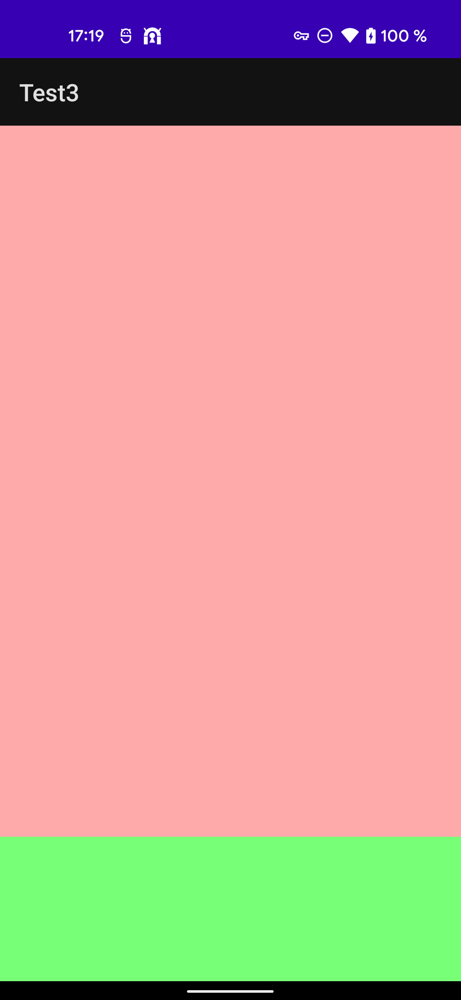

# flutter_add_to_app_bottom_padding_issue
Test flutter add-to-app repository which shows the bottom padding issue. This demonstrates it on Android, but from experience we know this also happens on iOS

* [StackOverflow](https://stackoverflow.com/questions/70670655/flutter-add-to-app-fragment-inserts-unnecessary-bottom-padding-when-keyboard-is)
* [Github/Flutter](https://github.com/flutter/flutter/issues/96520)




Build this with Gradle >7 or it will fail. Built with:
```bash
# gradle.wrapper.properties
distributionUrl=https\://services.gradle.org/distributions/gradle-7.0.2-bin.zip
```

```bash
# project level build.gradle
classpath "com.android.tools.build:gradle:7.0.4"
classpath "org.jetbrains.kotlin:kotlin-gradle-plugin:1.6.10"
```
